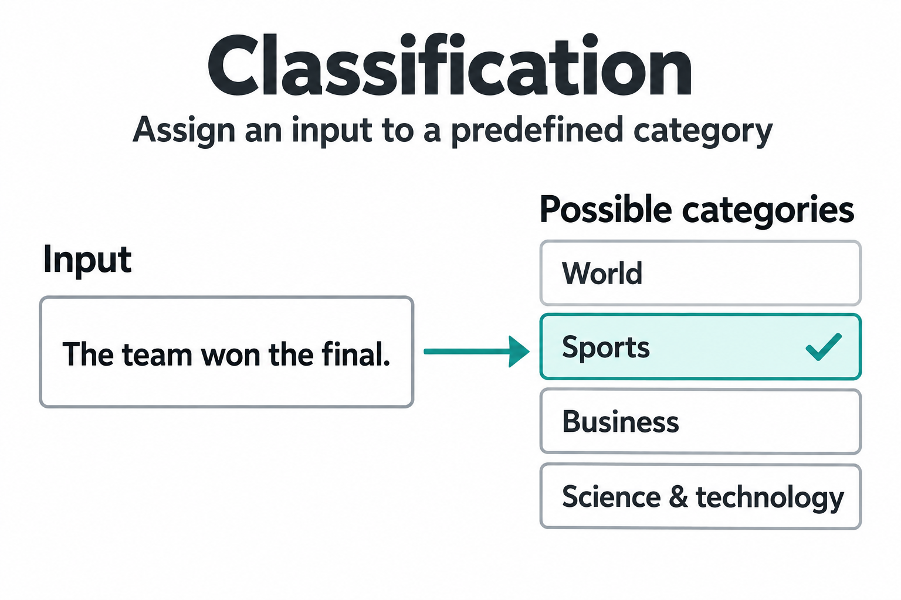
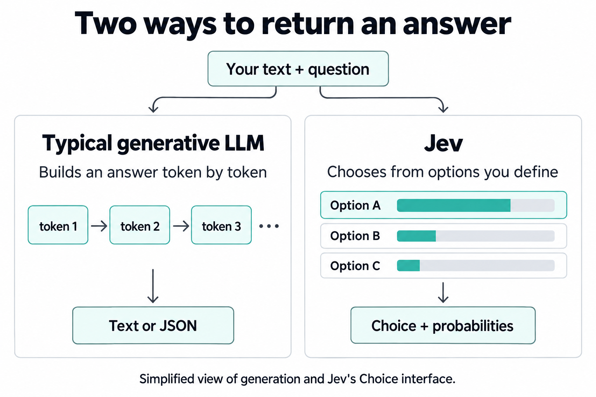

# My name is Jev

**tl;dr: Jev _was_ more accurate, faster and cheaper than GPT-4o mini in this small classification experiment.**

## What is Jev even?

You've probably seen Jev pop up in all of your social media feeds. But what is it even?

Jev is a model from [TypeSafe](https://docs.typesafe.ai/concepts/system-one) built to make decisions, such as choosing which category a piece of text belongs to.

This weekend I played around with a small toy problem to understand it better.

Let's say you want to classify some text. For example, you have news articles and you want to classify them into different themes.

Here are two ways you can do this:
1. **LLM (large language model)**: Give the text + a list of categories to an LLM and ask the LLM to categorise it.

2. **Jev**: You give Jev the same _input_, but instead of predicting the next token (a small piece of text), it predicts the _likelihood_ of the text belonging to each category and picks one.

## So is Jev better?

To find out, I did a [small experiment](https://github.com/emilesilvis/jev-experiment).

I looked for public datasets that _were already labeled_. I found these three:

1. The [AG News dataset](https://github.com/zhangxiangxiao/Crepe/tree/449852dc565d658e930f571a3ad2fb9107aeefb2) contains articles that are categorised according to theme: `world news`, `sports`, `business`, or `science and technology`.
2. A [question classification dataset](https://cogcomp.seas.upenn.edu/Data/QA/QC/) where the task is to identify the kind of question, with these categories: `people or groups`, `places`, `numbers`, `descriptions` or `explanations`, `abbreviations`, and `entities`.
3. The [SNIPS user intention dataset](https://github.com/sonos/nlu-benchmark/tree/b86ac7f1577868c42158d0dec77db50956046696/2017-06-custom-intent-engines) that classifies what a user wants to do: `play music`, `add music to a playlist`, `book a restaurant`, `check the weather`, `rate a book`, `find a creative work such as a film or song`, or `find movie showtimes`.

Then I hid the labels and gave Jev (1.13.0) and GPT-4o mini (2024-07-18) the same tasks: classify the piece of text using the supplied list of labels and return probabilities for each label. I could then use the hidden labels to score the accuracy of each model.

### Results

| Task | Jev accuracy | GPT-4o mini accuracy |
|---|---:|---:|
| News topics | 86.8% | 77.0% |
| Question types | 91.6% | 77.0% |
| User intentions | 96.9% | 90.0% |

So we see **91.7% accuracy for Jev and 81.3% for GPT-4o mini**. I counted answers with probabilities that didn't add up to one as wrong. Jev was also faster and cheaper.

You can reproduce this experiment by using https://github.com/emilesilvis/jev-experiment.
