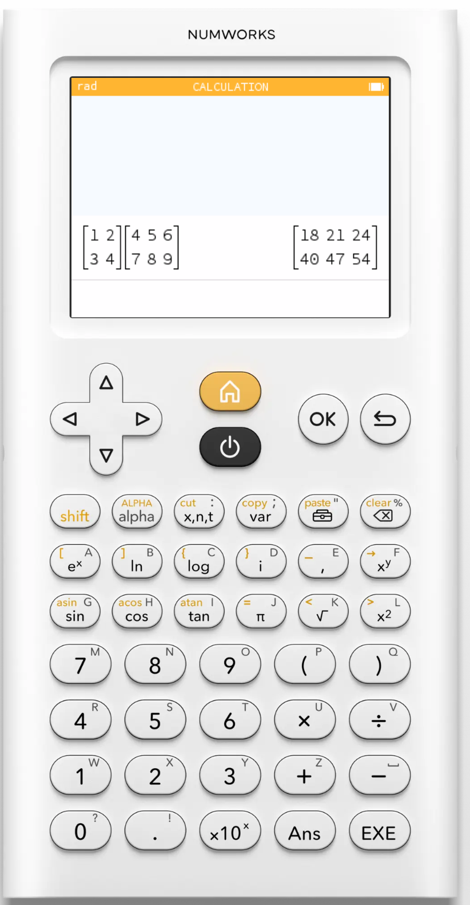
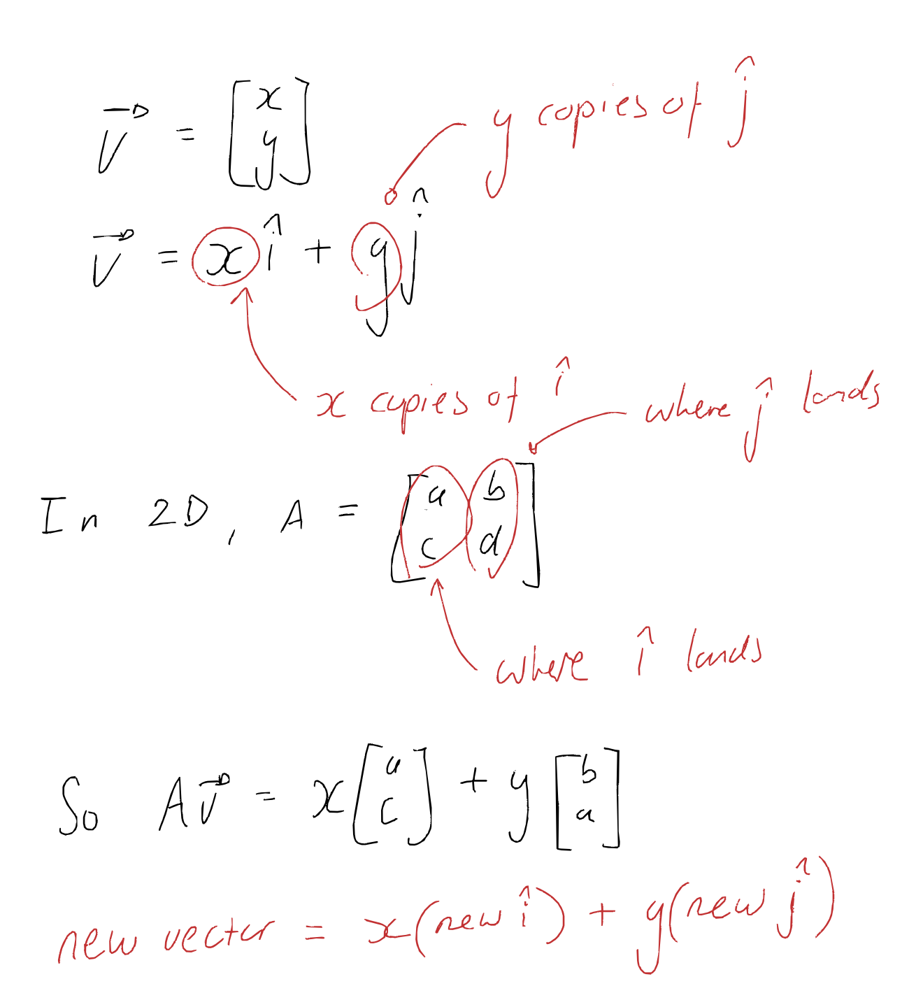

# Use AI like you'd use a calculator for matrix multiplication

For a while I’ve been thinking about how I want to view my relationship to GenAI as a tool, and I think I’ve settled on a metaphor: I use GenAI in the same way as I use a calculator to do matrix multiplication.

I’m busy relearning maths from the ground up, and I hate doing matrix multiplication by hand. I mostly use a calculator. But is that okay?

Multiplying matrices by hand is a pain in the butt. You multiply the elements of the row of the first matrix with the elements of the column of the second matrix and sum.

![Diagram of matrix multiplication: the row [1, 2, 3] and column [7, 9, 11] are highlighted, giving the dot product 58.](../static/images/use-ai-like-a-calculator/matrix-dot-product.png)

The problem here is twofold.

<figure style="max-width: 240px; margin: 1.5rem auto;">
  
</figure>

Mechanically there are a lot of moving parts. The “recipe” is easy enough to remember, but one small slipup will invalidate all of the work (frustrating). This is why just punching this into a calculator is way easier.

The second problem is the bigger problem: it’s wildly unintuitive. Sure, it’s easy enough to mechanically follow that little recipe, but what does it actually *mean*?

I’ve sat with not understanding this in the past (and still sometimes do) and then I force myself to write it out until I *get* it again.

Every time I use the calculator, I ask myself if I understand what it means. If I don’t, I take out pen and paper and go back to basics.

